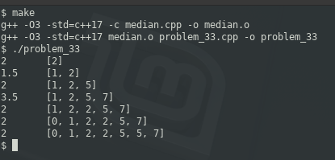

### PROBLEM 33 (easy)

This problem was asked by Microsoft.

Compute the running median of a sequence of numbers. That is, given a stream of numbers, print out the median of the list so far on each new element.

Recall that the median of an even-numbered list is the average of the two middle numbers.

For example, given the sequence [2, 1, 5, 7, 2, 0, 5], your algorithm should print out:
```
2
1.5
2
3.5
2
2
2
```
---

### SOLUTION

This is not a practical request since it requires all "streamed" values to be stored in order to determine the median. Any number which is the first or last element can eventually become a median if enough lower or higher values (respectively) are added.

If we wanted to optimize for performance, we could maintain pointers in order to have O(1) access to the median rather than the O(n/2) which is inherent to linked lists.


