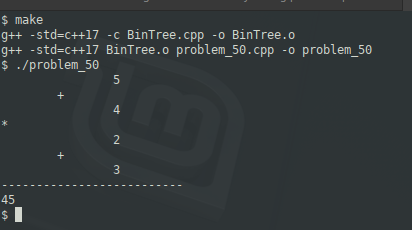

### Problem 50 (easy)

This problem was asked by Microsoft.

Suppose an arithmetic expression is given as a binary tree. Each leaf is an integer and each internal node is one of '+', '−', '∗', or '/'.

Given the root to such a tree, write a function to evaluate it.

For example, given the following tree:
```
    *
   / \
  +   +
 / \ / \
3  2 4  5
```
You should return 45, as it is (3 + 2) * (4 + 5).

---

### Solution

This is not a great fit for C++ because we can't define the value of the nodes as type "Object", as we could in Java. We have four options:

1. define the parameter as type (void *) and type cast it later, or:
0. define the parameter as a string (or array of characters) and determine if the string can be evaluated as a number, and if that fails, it's an operator.
0. Only assume a numeric value when we reach a leaf node
0. Each node should have both a "value" and an "operator" member (keeping in mind "operator" is a reserved word in C++)

I chose approach #4, where if the value of the node does not match any of the operators, then it must be numeric.

This exercise uses a "makefile" rather than requiring the entire compilation command to be typed. Simply type "make":



To ensure that the tree is properly constructed, I display on its side.
