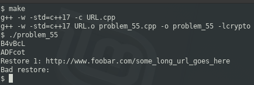

### Problem 55 (easy)

This problem was asked by Microsoft.

Implement a URL shortener with the following methods:

- `shorten(url)`, which shortens the url into a six-character alphanumeric string, such as `zLg6wl`.
- `restore(short)`, which expands the shortened string into the original url. If no such shortened string exists, return null.

Hint: What if we enter the same URL twice?

---

At first glance, the solution would seem to be a matter of generating 6 random alphanumeric characters, create a string from them, and store as a key/value pair. How many unique permutations can 6 characters give us? Each character can range between `a` to `z`, between `A` to `Z`, and `0` to `9`. The same letter in lowercase and uppercase is 2 distinct values. This gives us 26 + 26 + 10, or 62. The permutation is 62^6, or `56,800,235,584`. Sidebar: this is a nightmare for security folks since it results in weak cryptography.

In cryptography, one of the mechanisms employed is _hashes_. It is common to use MD5 hashes as a checksum, but we know that MD5's, despite yiedling 16 bytes (128 bits), will have collisions. Each of our alphanumeric characters (62 possible values) fits into 6 bits, and we have 6 characters. This means that our shortened URL will have less than 36 bits of unique values, significantly less than an MD5 hash.

The **hint** at the end of the question dictates whether we use the random approach or the hash approach. Using the random approach, the same URL will result in different shortened URL's, while using a hash will generate the same value each time.

In this exercise, we'll generate a SHA256 hash from the URL and then get the modulus 62 of the first 6 bytes to construct our shortened URL.

Contrary to one of the goals of these exercises, I had to use libraries which may not exist on the target system, and this compilation might fail.

In order to successfully build, you will need crypto libraries. In Debian-based distributions (Debian, Ubuntu, LinuxMint, Raspbian, Deepin, etc.), you can issue the following command (as root):

`# apt install libssl-dev`

Note that although the solution compiles and runs on a Raspberry Pi, it does not return the expected results. This is the exception, and to date, all other solutions run properly on the Raspberry Pi.