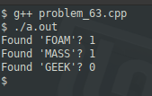

### Problem 63 (easy)

This problem was asked by Microsoft.

Given a 2D matrix of characters and a target word, write a function that returns whether the word can be found in the matrix by going left-to-right, or up-to-down.

For example, given the following matrix:
```
[['F', 'A', 'C', 'I'],
 ['O', 'B', 'Q', 'P'],
 ['A', 'N', 'O', 'B'],
 ['M', 'A', 'S', 'S']]
```
and the target word 'FOAM', you should return true, since it's the leftmost column. Similarly, given the target word 'MASS', you should return true, since it's the last row.

---
### Solution

There's not much to say here; it's pretty straight-forward. The only thing that is note-worthy is that this solution is best suited for C/C++. That is the only language (that I know of) where a C string (as opposed to a C++ string object) actually is an array of characters, making the "horizontal" searches trivial.


