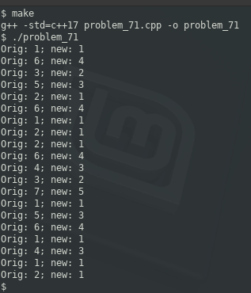

### Problem 71 (easy)

This problem was asked by Two Sigma.

Using a function rand7() that returns an integer from 1 to 7 (inclusive) with uniform probability, implement a function rand5() that returns an integer from 1 to 5 (inclusive).

---
There isn't much logic here; simply math. You essentially want to shrink numbers between 1 and 7 to results between 1 and 5. You can convert 7 to 5 by multiplying by 5/7, but if we do this with 1, we get 5/7, or approximately 0.7143 . If we want, we can add 0.3 to whatever the result is, and then take the floor of that result ... but we can avoid that altogether.

Instead of translating {1..7} to {1..5}, we can translate {0..6} to {0..4}, and then simply add 1. That leaves us with no rounding issues and work-arounds to deal with it.

