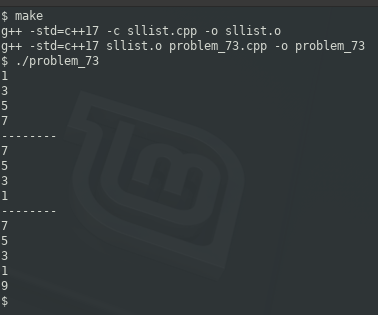

### Problem 73 (easy)

This problem was asked by Google.

Given the head of a singly linked list, reverse it in-place.

---
The solution is rather straight-forward. Imagine the following singly-linked list:

a -> b -> c -> d

All we need to do is change the pointers:

a <- b <- c <- d

For good measure, I appended one more item after the reverse to prove that "tail" is set properly:

