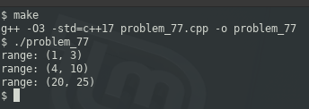

### PROBLEM 77 (easy)

This problem was asked by Snapchat.

Given a list of possibly overlapping intervals, return a new list of intervals where all overlapping intervals have been merged.

The input list is not necessarily ordered in any way.

For example, given `[(1, 3), (5, 8), (4, 10), (20, 25)]`, you should return `[(1, 3), (4, 10), (20, 25)]`.

---
### SOLUTION

I would have liked to solve this using a Range object, but that will not be available until C++20. Alternatively, it _is_ available in the Boost libraries, but I do not want to use any libraries which are not part of the STL or that do not come with the operating system (e.g. OpenSSL libraries **DO** come with the OS, so I used those in a previous example).

Only two comparisons need to be made, and each comparison covers 2 cases. When comparing two sets, if they overlap, it could either be as a result of "staggered" values or fully "encompassed" values:

```
set 1 = (4,8), set 2 = (6,9)
n       m
4 5 6 7 8 9
    x     y

set 1 = (4,9), set 2 = (6,8)

n         m
4 5 6 7 8 9
    x   y
```

In either case, the following is true:

n < x < m

The other set of cases is:

```
    n     m
4 5 6 7 8 9
x       y

    n   m
4 5 6 7 8 9
x         y
```

Both of those share the following property:

x < n < y

Output:

