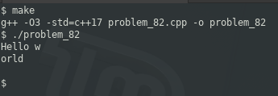

### PROBLEM 82 (easy)

This problem was asked Microsoft.

Using a read7() method that returns 7 characters from a file, implement readN(n) which reads n characters.

For example, given a file with the content “Hello world”, three read7() returns “Hello w”, “orld” and then “”.

---
This is best solved with descriptors rather than streams. That's not a very C++ way of doing things, but it is the best way, and I'm not going to make it a stream just for the sake of using a more C++ style approach.

