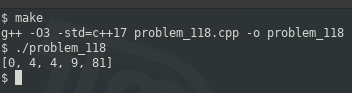

### PROBLEM 118 (easy)

This problem was asked by Google.

Given a sorted list of integers, square the elements and give the output in sorted order.

For example, given [-9, -2, 0, 2, 3], return [0, 4, 4, 9, 81].

---
### SOLUTION

This is trivial in python ... but we're not using python:

```python
l = [ x*x for x in [-9, -2, 0, 2, 3] ]
l.sort()
print(l)
```
A lot more verbose in C++, but here we are:


