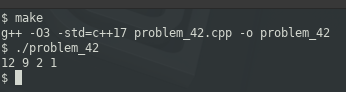

### PROBLEM 42 (hard)

This problem was asked by Google.

Given a list of integers S and a target number k, write a function that returns a subset of S that adds up to k. If such a subset cannot be made, then return null.

Integers can appear more than once in the list. You may assume all numbers in the list are positive.

For example, given S = [12, 1, 61, 5, 9, 2] and k = 24, return [12, 9, 2, 1] since it sums up to 24.

---
The approach for this was fairly straight-forward. The problem description does not impose the restriction of an immutable list. As such, sorting in descending order practically provides the solution. The only thing, at that point, which remains is finding the offset within the list where to begin, and then recursing over the list.

To find the offset where to begin, find the first value which is less than k. In the above example, sorting the list gives us [61, 12, 9, 5, 2, 1]. The first value less than k (24) is 12, at an offset of 1. Then we just iterate (or recurse) over the list, adding the current value to the running total, and if that exceeds k, skip that value, and continue until either the accumulator (or running total) matches k, or we exhaust all values in the list.

