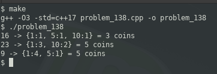

### PROBLEM 138 (hard)

This problem was asked by Google.

Find the minimum number of coins required to make `n` cents.

You can use standard American denominations, that is, 1¢, 5¢, 10¢, and 25¢.

For example, given `n = 16`, return `3` since we can make it with a 10¢, a 5¢, and a 1¢.

---
### SOLUTION

I think this question should be classified as easy since it is very straight-forward. As a result, I added a little more to it, whereby the output includes each type of coin and how many.

