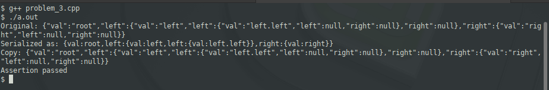

### Problem 3 (medium)

This problem was asked by Google.

Given the root to a binary tree, implement `serialize(root)`, which serializes the tree into a string, and `deserialize(s)`, which deserializes the string back into the tree.

For example, given the following `Node` class

```python
class Node:
    def __init__(self, val, left=None, right=None):
        self.val = val
        self.left = left
        self.right = right
```
The following test should pass:

```python
node = Node('root', Node('left', Node('left.left')), Node('right'))
assert deserialize(serialize(node)).left.left.val == 'left.left'
```
---
First and foremost, we're ditching Python in favor of C++, and this presents a problem because C++ has no built-in JSON standard library or support. I'll be the first to admit that C++ is the wrong language for this problem. Since one of the goals of these solutions is to be able to compile with no dependencies (e.g. Boost libraries), we will have to roll out our own serialization/deserialization methods, but they'll make certain assumptions (e.g. well-formed input string) and will be highly specialized. They will not be able to handle generic objects since, unlike Java, objects do not automatically inherit from Object(), and C++ supports multiple inheritance. Also note that C++ has no reflection, although it can be simulated, but that requires quite a bit of effort.

There are standard libraries which can aide in lexical analysis and parsing (Lex & Yacc or Flex & Bison). While it was possible to use these libraries, I opted to write a rudimentary parser and analyzer, which also means that the system isn't required to have them installed.

There is no requirement to serialize specifically as JSON. Nevertheless, I created a toJson() method simply for a visual representation, which gives us the following:

```javascript
{
    "val":"root",
    "left":{
        "val":"left",
        "left":{
            "val":"left.left",
            "left":null,
            "right":null
        },
        "right":null
    },
    "right":{
        "val":"right",
        "left":null,
        "right":null
    }
}
```
The `serialize()` method is based on the `toJson` method, but is less verbose; NULLs are not reported, and quotes are eliminated. The output of that is:

```javascript
{val:root,left:{val:left,left:{val:left.left}},right:{val:right}}
```

This sample output demonstrates a JSON representation, serialization, a JSON representation of the deserialized object, and a success message:


