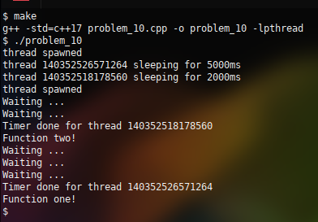

### Problem 10 (medium)

This problem was asked by Apple.

Implement a job scheduler which takes in a function `f` and an integer `n`, and calls `f` after `n` milliseconds.

---
Let's begin with the wrong way to implement this:

```
function f():
    do something

function scheduler(function, delay):
    sleep(delay)
    call function

main:
    scheduler(f, 2000)
```
This is not actually a scheduler; it's just refactoring a synchronous series of instructions.

A second idea is to basically reimplement the Vixie Cron system, but that is only accurate to the minute, and the requirement is milliseconds. This means that we cannot use a polling mechanism like cron since that would be a burden on the processor.

We are left with an asynchrous thread which knows when to "wake up" and begin processing.

Use the standard "make" utility to build:


