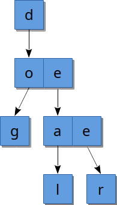
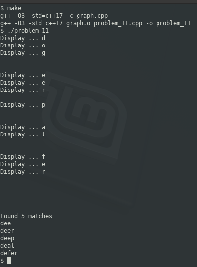

### PROBLEM 11 (medium)

This problem was asked by Twitter.

Implement an autocomplete system. That is, given a query string `s` and a set of all possible query strings, return all strings in the set that have s as a prefix.

For example, given the query string `de` and the set of strings [`dog`, `deer`, `deal`], return [`deer`, `deal`].

Hint: Try preprocessing the dictionary into a more efficient data structure to speed up queries.

---
### SOLUTION

An initial idea for the data structure is as follows:

```javascript
{
  "root": {
    "d": {
      "o": {
        "g": null
      }
    },{
      "e": {
        "e": {
          "r": null
        }
      },{
        "a": {
          "l": null
        }
      }
    }
  }
}
```
Instea, this approach borrows on the ideas of adjacency matrices and graphs (for a couple of reasons). We can have a matrix per letter that appear as follows (first the graph):



`d` leads to `o` (d __o__ g) and `e` (d __e__ a l, d __e__ a r)
```
  e o
d 1 0
```
The `e` in deal and deer then lead to:
```
  e a
e 1 1
```
And so on.

Why the graph/adjacency matrix? Two reasons:

1. If necessary, I can re-use not only the beginning of words but the ends as well since it's based on pointers. Imagine `deception` and `reception`: I could have an individual node for `d` and `r` and then use shared nodes for `eception`.
0. It is easier to maintain objects for nodes to indicate a case which has not been addressed. Both the initial "object" approach and the graph approach lack the ability to track words which "overlap". They both fail at storing `fat` and `fate`. We need a mechanism to indicate that `fat` is a complete word that has child nodes. With the object representation, `null` becomes insufficient as a differentiator from having child nodes, while my graph approach can easily incorporate class members, in our case `endNode = true`, to indicate that this node represents an end of a word, but the vector of child nodes can still be populated.

Output:


