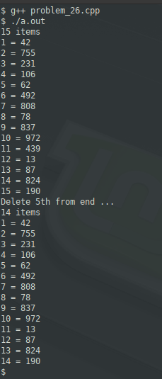

### Problem 26 (medium)

This problem was asked by Google.

Given a singly linked list and an integer k, remove the kth last element from the list. k is guaranteed to be smaller than the length of the list.

The list is very long, so making more than one pass is prohibitively expensive.

Do this in constant space and in one pass.

---
A constraint was immediately imposed, which is that the data structure needs to be a singly linked list. No other requirement is given, so we can add features to this linked list. The only feature we need to add is a list size. This means that we can determine when we have arrived at the _n-k_ element.

There is another approach, which I'll avoid; represent the linked list "backwards". In other words, the head/root element is the last element, and the tail is the first element. This is counter-intuitive and will be avoided.

