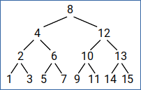
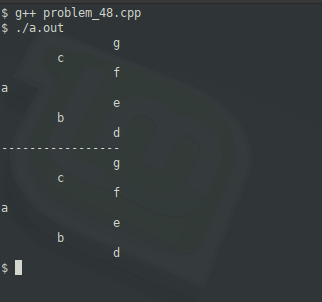

### Problem 48 (medium)

This problem was asked by Google.

Given pre-order and in-order traversals of a binary tree, write a function to reconstruct the tree.

For example, given the following preorder traversal:

[a, b, d, e, c, f, g]

And the following inorder traversal:

[d, b, e, a, f, c, g]

You should return the following tree:
```
     a
    / \
   /   \
  b     c
 / \   / \
d   e f   g
```
---
Recreating a binary tree from a list is relatively trivial. The inorder list simply requires halving the list until you are left with leaf nodes. Let's think of a longer list, but using a sorted binary tree (easier visually):



The preorder list is:

[1, 2, 3, 4, 5, 6, 7, 8, 9, 10, ..., 15]

Recursively, it is (in no particular language):
```
function recurse(node):
    print node
    if(node.left):
        recurse(node.left)
    if(node.right):
        recurse(node.right)
```
In-order simply changes the location of "print":
```
function recurse(node):
    if(node.left):
        recurse(node.left)
    print node
    if(node.right):
        recurse(node.right)
```
Let's take the pre-order, which is sequential numbers from 1 to 15. The midpoint is 8, which will become the root. This leaves us with 1-7 to the left of the root and 9-15 to the right. Focusing only on the left side, we see that 4 is that midpoint. Find the midpoint to the two remaining sets, and we get 2 and 6, and the leaf nodes off those (respectively) are 1,3 and 5,7. Algorithmically, this would look like (in pseudo code):

```
function recurse(list):
    if len(list) == 1: # cannot recurse any more
        return
    set value
    set left = recurse(left side of list / 2)
    set right = recurse(right side of list / 2)

recurse(list)    
```
Compile and run as usual.



Both the preorder and inorder results are show (flipped on their side). The difference is minor, which is where the assignments take place relative to recursion. Preorder (breadth-first) is basically:

```
assignment logic
recurse left
recurse right
```
Inorder (depth-firsth) is:
```
recurse left
assignment logic
recurse right
```
In either case, control statements are critical to properly end the recursion.