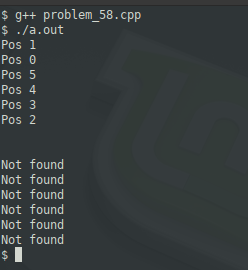

### Problem 58 (medium)

This problem was asked by Amazon.

A sorted array of integers was rotated an unknown number of times.

Given such an array, find the index of the element in the array in faster than linear time. If the element doesn't exist in the array, return null.

For example, given the array [13, 18, 25, 2, 8, 10] and the element 8, return 4 (the index of 8 in the array).

You can assume all the integers in the array are unique.

---
### Solution

The data structure here gives us the approach. A benefit of arrays is that we can access data in O(1). This property allows us to effectively perform a binary tree search. Let's take an unrotated, sorted array:

`[2, 8, 10, 13, 18, 25, 32]`

Let's call the array `A`. Find the midpoint. The indices of the array range from 0 to 6, and if we halve 6, we land on A[3], which is 13. If our search target is 25, we know we have to search to the right. We halve the right, A[3 **+ 1**] .. A[6] (start _after_ A[3] since it didn't match), which gives us A[5], which is our target of 25. In this case, we found our target in O(2) rather than O(6), the latter of which is "linear" and was to be avoid as per the requirements.

With a rotated array, we will use somewhat of the same approach. Let's use the original example:

`[13, 18, 25, 2, 8, 10]`

We first determine in which half the target must be, but since the array is rotated, we must use the first and last elements to help us make the determination. If we choose "25" as the midpoint, look at A[0]. Since that is less than our midpoint AND A[0] is greater than our target, then the target is on the right. Do this recursively.

In order to validate, the array was rotated into every possible position and tested for both happy and sad paths:

