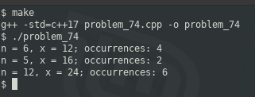

### Problem 74 (medium)

This problem was asked by Apple.

Suppose you have a multiplication table that is N by N. That is, a 2D array where the value at the `i`-th row and `j`-th column is `(i + 1) * (j + 1)` (if 0-indexed) or `i * j` (if 1-indexed).

Given integers N and X, write a function that returns the number of times X appears as a value in an N by N multiplication table.

For example, given N = 6 and X = 12, you should return 4, since the multiplication table looks like this:

| | | | | | |
|-:|-:|-:|-:|-:|-:|
| 1 | 2 | 3 | 4 | 5 | 6 |
| 2 | 4 | 6 | 8 | 10 | 12 |
| 3 | 6 | 9 | 12 | 15 | 18 |
| 4 | 8 | 12 | 16 | 20 | 24 |
| 5 | 10 | 15 | 20 | 25 | 30 |
| 6 | 12 | 18 | 24 | 30 | 36 |

And there are 4 12's in the table.

---
You can solve this in a very literal manner, whereby you create an in-memory multiplication table ... or you can recognize that this is actually an exercise in finding the factors of a number.

Finding the factors of a number is simply a sequential walk through positive (in this case) integers up to the square root. In the case of 12, this gives us {{1,12}, {2,6}, {3,4}}.

Now we apply additional rules: none of the factos can be greater than N, since the grid is N x N, and since the board will duplicate factors in reverse, we double the factors we find. That means that we filter out {1,12} and doulbe the remainder, since {6,2} and {4,3} are on the board. That gives us 4 sets of factors, the same number of times that 12 appears on the board.

