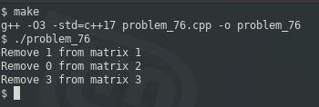

### PROBLEM 76 (medium)

This problem was asked by Google.

You are given an N by M 2D matrix of lowercase letters. Determine the minimum number of columns that can be removed to ensure that each row is ordered from top to bottom lexicographically. That is, the letter at each column is lexicographically later as you go down each row. It does not matter whether each row itself is ordered lexicographically.

For example, given the following table:
```
cba
daf
ghi
```
This is not ordered because of the a in the center. We can remove the second column to make it ordered:
```
ca
df
gi
```
So your function should return 1, since we only needed to remove 1 column.

As another example, given the following table:
```
abcdef
```
Your function should return 0, since the rows are already ordered (there's only one row).

As another example, given the following table:
```
zyx
wvu
tsr
```
Your function should return 3, since we would need to remove all the columns to order it.

---

### SOLUTION

The initial approach to matrices is to implement them as two-dimensional arrays. In this case, that would be `char arr[][]`, although the second subscript cannot be initialized without providing the size. Also, passing multi-dimensional arrays loses the size of each dimension: does a memory allocation of 12 units represent a 6x2 or 4x3 array?

To resolve the size ambiguity, I decided to use the array object from the STL, which behaves a lot like standard arrays but with some added benefits, like knowing the true sizes of the dimensions. However, THAT turned out to be an issue when passing them to a function, since the function expects to know the size up front. I ended up with a two-dimensional vector of chars.

The good thing about C/C++ is that one does not have to get the ordinal value of chars; you can compare them as is.


