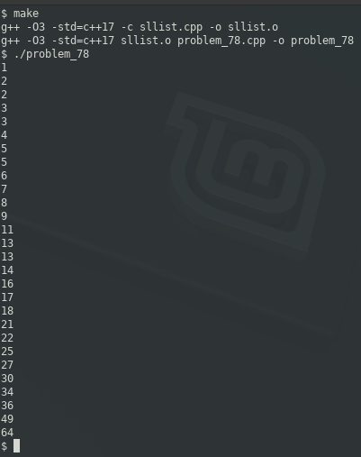

### PROBLEM 78 (medium)

This problem was asked by Google.

Given k sorted singly linked lists, write a function to merge all the lists into one sorted singly linked list.

---
### SOLUTION

We will have to create singly linked lists that borrow an idea from python, which is iterable/yield. We have two options on the approach for creating the new list:

1. create new pointers with a copy of the values from othe other lists
0. use the pointers from the existing lists and reference those

The requirements are ambiguous, and I decided to take approach #1, since the new list is truly a new list, and it obviates the need for me to return points, allowing us to focus simply on values.

Another ambiguity is what to do in the event multiple lists have the same value. If list A has a `3` and list B has a `3`, should our new list contain a single `3`, or should we have two of them? We'll err on the side of caution and preserve both.

I found that the requirements could result in a bunch of unsightly `if` statements comparing the first to the second to the third lists. I changed the nature of the requirements, whereby the solution should merge _n_ lists, and I tested with 4 lists.

