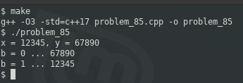

### PROBLEM 85 (medium)

This problem was asked by Facebook.

Given three 32-bit integers x, y, and b, return x if b is 1 and y if b is 0, using only mathematical or bit operations. You can assume b can only be 1 or 0.

---
### SOLUTION

This was complete guesswork, seeing what combination of XOR and two's complement would work, until I found the combination of operations.

If b is 0, we subtract 1 and it wraps to 0xffffffff, or all 1's in binary. To make it easier, let's use a nibble rather than a 32-bit number.

If b is 0000, subtracting 1 makes it 1111; if b is 0001, subtracting 1 makes it 0000. After performing the -1 operation, we XOR the original number with b-1, we OR it with the original, and then we subtract b-1. Let's consider both scenarios:

```
    1010    original number
XOR 0000    b was 1, -1 makes it 0
    ----
    1010
OR  1010    OR with original number
    ----
    1010
-   0000    subtract b-1
    ----
    1010    final result
```
Now let's duplicate the sequence with b = 0:
```
    1010    original number
XOR 1111    b was 0, -1 makes it 1111
    ----
    0101
OR  1010    OR with original number
    ----
    1111
-   1111    subtract b-1
    ----
    0000    final result
```
The remainder of the logic involves absolute value and addition; read the code.


