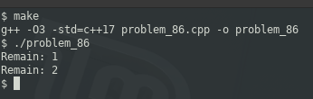

### PROBLEM 86 (medium)

This problem was asked by Google.

Given a string of parentheses, write a function to compute the minimum number of parentheses to be removed to make the string valid (i.e. each open parenthesis is eventually closed).

For example, given the string "()())()", you should return 1. Given the string ")(", you should return 2, since we must remove all of them.

---
### SOLUTION

Firstly, this is definitely not a "medium" problem; it should be easy. It's simply a matter of pushing onto a stack and popping off when counterpart is found, and whatever remains on the stack is the mismatch.

We will leverage C++'s Standard Templates Library (STL) to provide the stack.

