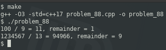

### PROBLEM 88 (medium)

This question was asked by ContextLogic.

Implement division of two positive integers without using the division, multiplication, or modulus operators. Return the quotient as an integer, ignoring the remainder.

---
### SOLUTION

This can be accomiplished by repeatedly subtracting the divisor from the dividend, but that can be extremely inefficient. Imagine dividing one million by 2; that would require 500,000 iterations. My approach is MUCH more interesting, and has a constant efficiency of O(32) ...

Surprisingly, my solution is an adaptation (or implementation) of performing division in assembly language on the Motorola 6502 processor. The 6502 lacks division and multiplication commands, and I was elated when I moved to the Intel 8088 since it did have those instructions (and more registers, and 16-bit numbers, etc.) This is code to divide 15 by 4:

```
		LDA #0F
		STA dividend
		LDA #4
		STA divisor
		LDA #0
		STA quotient

		LDX #8
DLOOP:	ASL dividend
		ROL
		CMP divisor
		PHP
		ROL quotient
		PLP
		BCC NOSBC
		SBC divisor
NOSBC:	DEX
		BNE DLOOP
		STA remainder
		RTS
```
The process is as follows: rotate the dividend into the accumulator one bit at a time (hence the `X` register containing 8 due to 8 bits) and attempt to subtract the divisor from the accumulator. If it can be subtracted, roll the _carry flag_ into the quotient and reset the accumulator with the result of the subtraction. Repeat until the `X` register is 0:

```
x divisor     accum       dividend     quotient
8 0000 0100 | 0000 0000 ~ 0000 1111 -> 0000 0000
7 0000 0100 | 0000 0000 ~ 0001 1110 -> 0000 0000
6 0000 0100 | 0000 0000 ~ 0011 1100 -> 0000 0000
5 0000 0100 | 0000 0000 ~ 0111 1000 -> 0000 0000
4 0000 0100 | 0000 0000 ~ 1111 0000 -> 0000 0000
3 0000 0100 | 0000 0001 ~ 1110 0000 -> 0000 0000
2 0000 0100 | 0000 0011 ~ 1100 0000 -> 0000 0000
1 0000 0100 | 0000 0111 ~ 1000 0000 -> 0000 0001 -> accum 0000 0011
0 0000 0100 | 0000 0111 ~ 0000 0000 -> 0000 0011 -> accum 0000 0011
```
Whatever remains in the accumulator at the end is the remainder.

This implementation is faithful to the original, albeit not always in an obvious way. Although the requirement states that the remainder is to be ignored, I did not ignore it. If you set the DEBUG flag, you can see all the intermediate steps (disabled in sample output):


