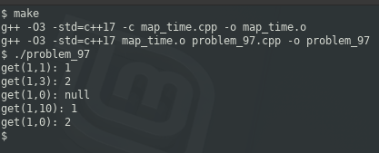

### PROBLEM 97 (medium)

This problem was asked by Stripe.

Write a map implementation with a get function that lets you retrieve the value of a key at a particular time.

It should contain the following methods:

- `set(key, value, time)`: sets key to value for t = time.
- `get(key, time)`: gets the key at t = time.

The map should work like this. If we set a key at a particular time, it will maintain that value forever or until it gets set at a later time. In other words, when we get a key at a time, it should return the value that was set for that key set at the most recent time.

Consider the following examples:
```
d.set(1, 1, 0) # set key 1 to value 1 at time 0
d.set(1, 2, 2) # set key 1 to value 2 at time 2
d.get(1, 1) # get key 1 at time 1 should be 1
d.get(1, 3) # get key 1 at time 3 should be 2
```
```
d.set(1, 1, 5) # set key 1 to value 1 at time 5
d.get(1, 0) # get key 1 at time 0 should be null
d.get(1, 10) # get key 1 at time 10 should be 1
```
```
d.set(1, 1, 0) # set key 1 to value 1 at time 0
d.set(1, 2, 0) # set key 1 to value 2 at time 0
d.get(1, 0) # get key 1 at time 0 should be 2
```
---
### SOLUTION

Depending on the language you use, your solution will vary. In C++, the Standard Template Library implementation of a `map` uses sorted keys, while `unordered_map` was introduced in C++11. Python, however, implements `dict` with unordered keys, which means there is no out-of-the-box data structure that simplifies the solution.

Since we are implementing this in C++, we are actually at an advantage. The implementation uses nested maps, and if we consider the first provided example, our data structure will look like this:

```javascript
{
    1: {
        0 : 1,
        2 : 2
    }
}
```
With a key of 1, the value is 1 starting at time 0, and it is 2 starting at time 2. Since the keys are ordered, we are guaranteed that the data structure will always look this way.


