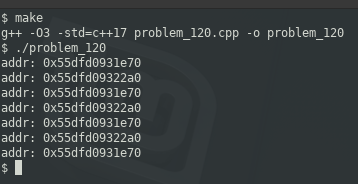

### Problem #120 (medium)

This problem was asked by Microsoft.

Implement the singleton pattern with a twist. First, instead of storing one instance, store two instances. And in every even call of `getInstance()`, return the first instance and in every odd call of `getInstance()`, return the second instance.

---
### Solution

This is fairly straight-forward and should probably be an easy problem. One property of a singleton is that you should not be allowed to instantiate the class directly. The way to prevent this is to create a private constructor. The only instantiation would happen directly from within the class.

In this example, attempting to compile code that instantiates the class results in the following:

```
problem_120.cpp: In function ‘int main()’:
problem_120.cpp:45:27: error: ‘Single::Single()’ is private within this context
  Single *foo = new Single();
                           ^
problem_120.cpp:13:1: note: declared private here
```

The sample output shows that only two objects are created (via their addresses), and repeatedly calling .getInstance() alternates between one of two objects:


