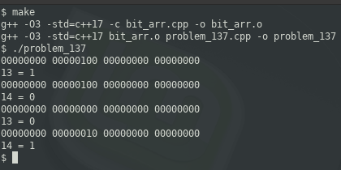

### PROBLEM 137 (medium)

This problem was asked by Amazon.

Implement a bit array.

A bit array is a space efficient array that holds a value of 1 or 0 at each index.

* `init(size)`: initialize the array with `size`
* `set(i, val)`: updates index at `i` with `val` where `val` is either `1` or `0`.
* `get(i)`: gets the value at index `i`.

---
### SOLUTION

C and C++ are adept at this since these languages are tightly coupled with memory management. Arrays can be addressed as pointers and vice versa.

The crux of this problem lies in the `set` method, much of whose logic is repeated in the `get` method.
Let's say that you want to set the 13th element: you need to skip bits 0-7 (byte 0) and modify bit 6 from byte 1. We have two options on setting: if we need to set a "1", we can OR that bit with 1 (00000100 in this case, 13). We can also add 00000100. However, the second approach presents a problem: what if that bit is already set? Then our addition will improperly alter the value of that byte. The former approach is the proper one (plus, logical operators are more efficient anyway).

